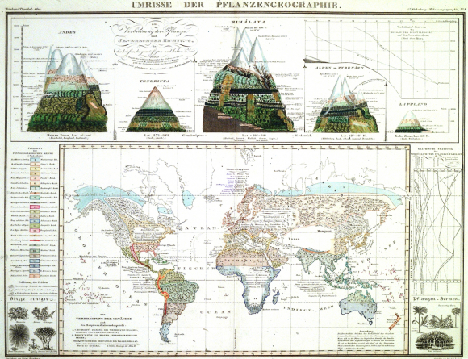
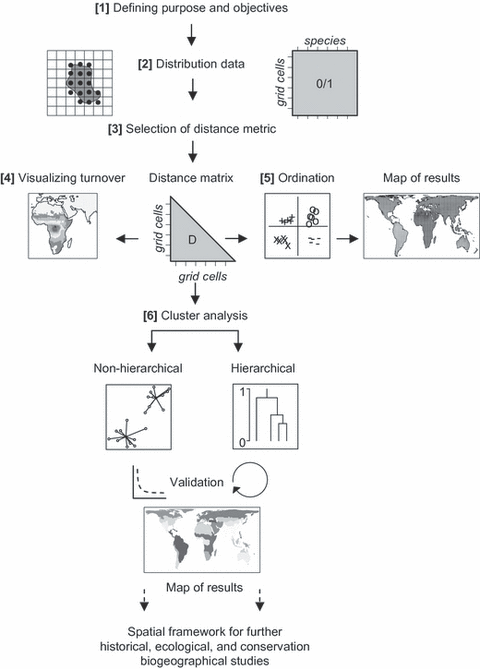
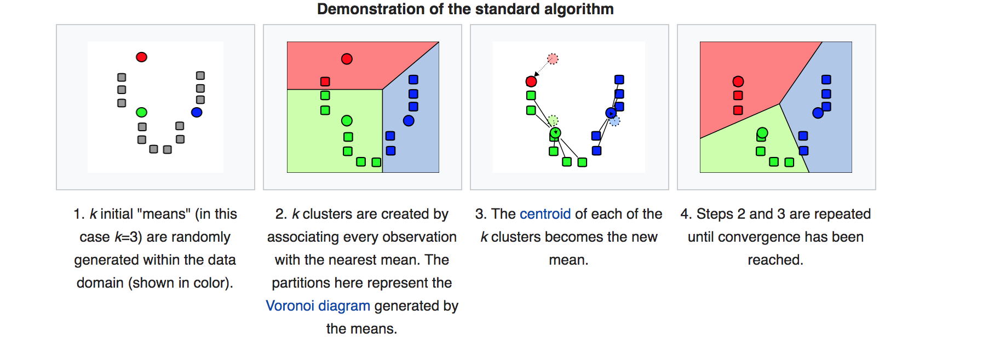

# Introduction 

## What is biogeographic regionalization?

- The characterization of geographical areas in terms of biodiversity.

- *Fundamental abstractions of life organization in the planet* in **response** to past or current ecological forces. 

In summary, biogeographic regionalization look to define the patterns of how life is distributed in Earth.


```{r, echo = F, fig.align="center", out.width="100%", fig.cap="Phytogeographic regions and new subregions proposed for Australia. (Gonzalez-Orosco et al. 2014: 10.1371/journal.pone.0092558) "}
a <- magick::image_read("figs/PhytoAus.png")
b <- magick::image_crop(a, "2000x1800+50")
c <- magick::image_crop(
  magick::image_rotate(a,180), "2000x1150+50")

c <- magick::image_rotate(c, 180)
mosc <- magick::image_append(c(b,c))
mosc

```


## Historical background 


- Biogeograhic regionalization have been a problem in ecological research since the **18th** century. 

- Early naturalists started to describe global pattenrs. e.g. vegetation zones, climate-diversity relationships. 


```{r, echo = F, fig.align="center", out.width="250%",fig.cap="Umrisse des Plfanzengeographie (Outline of the Geography of Plants)H. Berghaus, 1851, Physikalischer Atlas, vol V, plate No. 1."}




```


Biogeographic regionalization have also been critisized for different reasons:

  - static vs fluid faunas 
  - areas of endemism are an artifact of sampling
  - comparisons across taxa 

Recently, there was a renovated interest in biogeographic regionalization looking to include to phylogenetic relationships.  
 
In addition, new global databases provide basis for newer studies aimed to define global regions 
 
```{r, echo = F, fig.align='default', out.width="230%", fig.show='hold', message=F, fig.cap="left: Kreft and Jetz 2010 | right: Holt et al. 2012"}


figA <- magick::image_border(
  magick::image_read("figs/KreftJetz2010Regions.gif"), 
  "white", "20 x 10")
figB <- magick::image_border(
  magick::image_read("figs/F3.large.jpg"),
  "white", "20 x 10")


img <- c(figA, magick::image_scale(figB, "571"))
mosc <- magick::image_append(img)
mosc
 
```


## Relevance 
 
- Separation of global biodiversity in discrete units for analisis / comparison.

- Provide with spatially explicit answers to basic and applied questions in ecology, biodiversity science, conservation, etc.

    - one taxa -> Areas of endemism

    - one clade -> Phyto / Zoo geographic regions 

- Evolutionary history and relationships between major geographical regions 

- Links with environmental / biotic variables (e.g. isoclines, precipitation) 


## Classic workflow to delimit biogeographical regions 

**Hyerachichal framework**


Updated steps according to **Morrone et al. 2018**


1.- Defining study area

2.- Assembling distributional data

3.- Identifying natural areas 

4.- Discovering area relationships 

5.- Defining boundaries/transition zones

6.- Regionalizations

7.- Area nomenclature 

#### Kreft and Jetz 2010 Workflow. 

```{r, echo = F, out.width="100%", fig.align="center", fig.cap="Kreft and Jetz 2010. A framework for delineating biogeographical regions" }

```


[Kreft and Jetz. 2010. A framework for delineating biogeographical regions based on species distributions](https://onlinelibrary.wiley.com/doi/full/10.1111/j.1365-2699.2010.02375.x)

[Morrone 2018. The spectre of biogeographical regionalization](https://onlinelibrary.wiley.com/doi/full/10.1111/jbi.13135)


# Tutorial: Delimiting biogeographic regions using R 

## Workshop objectives 

1) Understand the basis of biogeographical regionalization
2) Retrieve species occurrences programatically 
3) Quantify turnover across communities
4) Cluster commnutinies based on dissimilarity values
5) Visualize and export the results 


## Dependencies 

These are the packages you will be using for this workshop. 

```{r, message= F}
library(mapr)
library(mapplots)
library(ggplot2)
library(rgbif)
library(raster)
library(plyr)
library(rgdal)
library(betapart)
library(RColorBrewer)

```

**Remember!!**

You can install packages using the `install.packages("packageName")`function.

You can get to the help page of any package/function by typing `?` and the package/function name. e.g. `?ggplot2`. 


## Defining the region of interest (ROI)


*This section corresponds to: (1) Defining study area and (1) Defining purpose and objectives from both frameworks (i.e. Morrone / Kreft)*

Defining region of interest, commonly abbreviated as **ROI**, is not more than delimiting geographic area in which you (*the researcher*) are interested. 
For example, you might only be interested in ecological process happening at a any given site, city, province, continent, or planet. As such, and depending of the particular question and interest, the boundaries of the ROI might coincide with political and/or physical boundaries.

Is important to clearly define the ROI because the spatial conclusions you can derive will only apply within the limits of the ROI. Additionally, size and shape of ROI might dramatically change the patterns observed. 

These are two very simple common ways to define the ROI: 

 1) Using standardized geographical units. (e.g. political divisions, eco-regions, etc.)
 
 2) Defining a extent polygon using geographical coordinates (e.g. bounding box)


Using the first alternative, focusing in country-wide ecological patterns is commonly needed. Luckily because of globalization needs, most of the world accepted political divisions and units are already standardized to match unique strings of 3 characters. Have you observed the city codes of your plane ticket? (e.g. Montreal Airport  = YUL) These are called isocodes (because ISO standards). You can query the isocode for any political unit. 

Let's take a look for the isocode list at the country level. 

This list shows how country names are coded in the GBIF database and its corresponding isocodes

```{r}
head(isocodes) ## remember to load the rgbif package
tail(isocodes)
```


Let's now explore how to query the codes for the country (or countries) we are interested. 


```{r}

roiNames <- c("United States", "Canada") ## You can modify the vector here to match any desired countries
  
roiCodes <- isocodes$code[match(roiNames,isocodes$name)]
names(roiCodes) <- roiNames
roiCodes
```
 
**NOTE** If you are interested to find isocodes for additional entities other than countries look at the `ISOcode` R package. 


## Downloading species occurrences from gbif 

*This section corresponds to: (2) Assembling distributional data and (2) Distribution data (i.e. Morrone / Kreft)*


The [GBIF](https://www.gbif.org) (Global Biodiversity Information Facility) is a global (and the biggest) repository of species occurrence data. You can explore and download the information from their webpage. However, there is also an API (Application Programmable Interface) freely available. API's allow for programmatic communication between computers and servers. We will access to the GBIF server  via the `rgbif` package for R. 

Remember to use `?` to explore and get familiarized with all the contents of the package.

For now we will explore the functions only to retrieve the data. 

First lets try with a basic search 

```{r}

# Let's define the taxa we are interested
taxa4search <- c("Hymenoptera")
query <- expand.grid(roiCodes, taxa4search, stringsAsFactors = F)
names(query) <- c("country", "taxa")


## Let's use the occ_data() function from rgbif along with an sapply function to write a function that allow us to search for the occurrences each of the taxa and country combinations.  

customSearGBIF <- function(query, limit,...){ 
  
  sapply(1:length(query$country), 
         function(x) rgbif::occ_data(
           scientificName = query$taxa[[x]], 
           country = query$country[[x]],
           limit = limit))
  }


testSearch <- customSearGBIF(query, 20)
testSearch[,1]$meta
testSearch[,2]$meta
```

That is a lot of information available for Hymenopteras both in the US and Canada

However, we have not downloaded the information yet. We did a test search to obtain the number of records available, that is why we set the limit = 20. (i.e. download only 20 records) The reason that we can not download everything at once is to prevent the API to collapse because of many simultaneous calls from around the world. So, the people at GBIF have set a download limit of 300 for each API call. In other words, we can only download 300 occurrences at each call of the `occ_data()` function. 


Now let's see all the variables we can obtain from a gbif search 

```{r}
names(testSearch[,1]$data)

```

That is a lot of information classes available for a particular occurrence observation. However, we should take in account that the GBIF data is heterogeneous. That is it comes from many sources. The staff at GBIF work hard to standardize all this data, but it that is still a limitation. For example, let's see from our 20 sample records how many of those occurrences correspond to species level information 

```{r}

par(mfrow = c(1,2), las = 1)
barplot(prop.table(
  table(testSearch[,1]$data$taxonRank)), 
  main = "US",
  ylim = c(0,1)
  )
barplot(prop.table(
  table(testSearch[,2]$data$taxonRank)), 
  main = "CA",
  ylim = c(0,1)
  )


```


That shows that around 80% of our occurrences are species level occurrences. 

OK, since we are now familiar with the results we can obtain from each search call, lets expand this to get mor than only 20 occurrences. Remember that the API only accepts 300 occurrences per call. *see* `?occ_data` for more details. You should repair in the "start" and "hasCoordinate" parameters. 

remember there is different amount of data available for each country
```{r, echo=F}

barplot(c("US" = testSearch[,1]$meta$count, "CA" = testSearch[,2]$meta$count))

```

Let's define the starters for each call
 

```{r, eval = T }

testSearch[,2]$meta$count
starters <- sample(1:testSearch[,2]$meta$count, 2) ## Modify this line to change the total "occurrence pages" downloaded
HymCA_US <- c()

for(i in 1:length(starters)){ 
  print(paste("Starting with query", i, "of 100")) # print the loop status
  HymCA_US[[i]] <- customSearGBIF(query = query,
                        limit = 300,
                        list("start" = starters[i], 
                             "hasCoordinate" = T) # listing the extra arguments for occ_data function
         )         
  
Sys.sleep(15) # To give a rest of 15 secs between each call
cat("\014") ## clean the console
  }
# examine the extructure of the information and subset to US = [,1], Canada = [,2]

HymCA_US[[1]]

```


Let's know do some housekeeping in the data we retrieved 

```{r, eval = T}

## Subset data for US
HymUS <- lapply(1:length(HymCA_US), function(x) data.frame(HymCA_US[[x]][,1]$data))
HymUS <- dplyr::bind_rows(HymUS)

## Subset data for Canada 
HymCA <- lapply(1:length(HymCA_US), function(x) data.frame(HymCA_US[[x]][,2]$data))
HymCA <- dplyr::bind_rows(HymCA)


## Bind both datasets
HymBoth <- dplyr::bind_rows(list(HymUS, HymCA))
```


Good! Now we have our dataset combined let's get an overview of the information collected

```{r,  out.width="200%"  }
par(mfrow = c(3,1), las = 2)
# frequency plot the taxonomic resolution of our dataset
barplot(prop.table(table(HymBoth$taxonRank)), ylim = c(0,1))
barplot(prop.table(table(HymBoth$stateProvince)), ylim = c(0,0.4), las = 2)
barplot(prop.table(table(HymBoth$family)), ylim = c(0,0.4), las = 2)
```


```{r}
grid <- mapplots::make.grid(HymBoth$decimalLongitude,
                  HymBoth$decimalLatitude,
                  rep(1, length(HymBoth$scientificName)), 
                  byx = 2, 
                  byy =  2, 
                  xlim = range(HymBoth$decimalLongitude),
                  ylim = range(HymBoth$decimalLatitude))

```

```{r out.width="200%"}
## Plot the distribution of available information 
maps::map(col = "grey", 
          regions = c("USA", "Canada"), 
          xlim = c(-170,-50))
title("Hymenoptera first 60000 occurrences per 2x2 grid")
draw.grid(grid, col = heat.colors(12,1, rev = T))

  
```

Depending of the amount of data recollected the last operation might have taken some time. To avoid running this lengthy process each time, we can store the object directly as a file in our working directory. The file extension for R objects is .RDS 

```{r}
## Save the object 
#saveRDS(HymBoth, "HymCA_US.RDS") # save the object

```


## Biogeographic regionalization 

For this section we will use previously downloaded datasets. We use a dataset of herb species occurrence data across the United States.
It is a dataset of the abundance of herbaceous species across ~15,000 plots across the US, along with related site date (e.g. climate, soil pH, etc.).

You can access the data [here](https://catalog.data.gov/dataset/herb-species-occurrence-data-across-the-us)

Alternatively, the dataset is also available in the gitHub repository. 

### Identyfing natural areas 

```{r}


herb <- read.csv("Data_gram_forb_abund_and_site_attr_w_no_grad_or_soil_filter_31Mar2016_both_N_and_S.csv")
names(herb)

herb <- herb[c("species", "latitude","longitude")]


```


Since our study area is big (almost all of the North American continent) it become obvious that the ROI is not geographically homogeneous. It is a good practice to get familiarized with the abiotic conditions and gradients along the ROI that might influence our results. Also it could help us to formulate adequate spatially-explicit hypothesis. 

Let's explore the main abiotic gradients in the EU and Canada.

A great source for global scale geo-physical datasets is the Earth Engine Google data catalog 

https://developers.google.com/earth-engine/datasets

**Short questions for discussion** 

- Which abiotic conditions can afect our results? 

- Which data can be useful for our purposes? 

- What are the limitations of using one/other datasets? 

- Do you know about other data sources at global scales?

## Quantifying community level dissimilarities 

*This section corresponds to: (4,5) of Morrone framework and (4,5,6) of Kreft framework*


Creating an species by site matrix at the grid level 

Each grid becomes an individual community

```{r}
# Aggregate into latitude longitude intervals so the resulting grid is aprox 1x1 

Ncut <- round(diff(range(herb$latitude)))

herb <- tibble::add_column(herb,
                          "interval" =  paste(cut(herb$latitude, Ncut),
                                              cut(herb$longitude, Ncut)))


head(herb)
# Make the species by site matrix
specTab <-  table(herb$interval,herb$species)
specTab[specTab > 1] <- 1 # turn into presence absence matrix

```


--------

A short reminder about beta-diversity [here](http://webspersoais.usc.es/persoais/andres.baselga/beta.html)

------

We will use the Simpson dissimilarity index (Simpson, 1943, 1960 ;Baselga 2010), because it works better for the biogeographic regionalization purposes. 
 
 
$$ S_i = \frac{a}{a + min(b,c)} $$
 
This index can be calculated with the framework of Baselga. 2010 which portions the nestedness-resultant component of dissmilarity of the Sorensen dissimilarity index. In other words, Simpson index is the turnover component of the Sorensen index. 


```{r}
# Calcualate "simpson dissimilarity index" (Bsim part of sorensen dissimilarity)
part <- betapart::beta.pair(specTab, "sorensen")
summary(part$beta.sim) ##  access the portion of the object that correspond to the Simpson index of dissmilarity 

## Alternatively you can use the "vegan" package to calculate the same index. 

# vegan::betadiver(matrix, "sim")

```


#### Visualizing turnover (B-diversity)

The heatmap base function is a great way to visualize the matrix 

```{r}
heatmap(as.matrix(part$beta.sim), col = topo.colors(5)) # play with different color schemes and palette gradients! 
```

**Short questions**

- What inferences can be done from a quick look at this matrix?

- Is there a clear pattern? 

Now lets plot the dissimilarity distances in a map

```{r}

# let's use our first grid in the matrix as focal point
fp <- as.matrix(part$beta.sim)[,1]


## lets make a new dataframe with the info 

map <- data.frame("lat" = herb$latitude[match(names(fp),herb$interval)])
map$lon <- herb$longitude[match(names(fp),herb$interval)]
map$fp <- fp


## lets define a function to create color palette from continous data! Very useful!!

f <- function(x,n=10, pal, rev = F){
  if(rev == F){ 
    rev(RColorBrewer::brewer.pal(n, pal))[cut(x,n)]
  }else{
      (RColorBrewer::brewer.pal(n, pal))[cut(x,n)]
    }
}


## Define the color vector for the plot 

colPlot <- f(map$fp, 10, "Spectral", rev = T)

# define color vector for the legend
toLeg <- data.frame(unique(cbind(round(map$fp, 3),colPlot)))
toLeg <- toLeg[order(toLeg$V1),]

plot(map$lat~ map$lon, 
     pch = 16,
     cex =2,
     ylim = c(20,70),
     xlim = c(-160, -50),
     xlab = "Longitude",
     ylab = "Latitude",
     main = paste("Dissimilarity from focal grid", 
                  names(fp)[1]),
     col = colPlot)

maps::map(col = "grey", add = T,
          regions = c("USA", "Canada"))


```


### Ordination 


*This section corresponds to: (5,6) of Morrone framework and (6) of Kreft framework*

Ordination are a set of statistical techniques used principally to reduce the dimensionality of a matrix. In our case we can think about sites and species as dimensions. Using this vector we can construct the most parsimonious organization in 2d (or more) space. 

We will use a technique called Non-Metric Multidimensional (NMDS) scaling to find the most parsimonious arragement of our distance-matrix items that preserve the community wide pattern of pairwise distances between species and sites. 

We will not to go into details of the procedure, but if you need a reminder of ordination methods or the mathematical basis of NMDS you can find information in the following links:

Ordination: 
  
  http://ordination.okstate.edu/overview.htm

  https://wiki.qcbs.ca/r_workshop9

NMDS: 

  http://www.flutterbys.com.au/stats/tut/tut15.1.html

  http://cc.oulu.fi/~jarioksa/opetus/metodi/vegantutor.pdf
      
      

```{r, out.width="200%", message = FALSE}

## Calculate non-metric multidimensional scaling using the intervals as sites
metaMDS <- vegan::metaMDS(part$beta.sim) ## simpson index better than Jaccard for biogeographical regionalization 

plot(metaMDS, "sites",
     main = paste("NMDS Herbs US","\n",
                  "stress =", round(metaMDS$stress,4),
                  "tries =", metaMDS$tries))


```


### Mapping the NMDS

Ok, now lets project the NMDS axis to the grid that we previosly created 

```{r}

## get the scores of the nmds and add it to new dataframe with the interval info
scores <- data.frame(cbind(rownames(specTab),
                           vegan::scores(metaMDS, "sites")),
                     stringsAsFactors = F) # Note I'm avoiding the creation of factor type data
```


```{r}
## Lets transform the data to numeric! 
str(scores)
names(scores)
scores[,c(2,3)] <- sapply(scores[,c(2,3)], function(x) as.numeric(x))
str(scores) # (y)


## Add the lat and long of each interval

scores$lat <- herb$latitude[match(scores$V1,herb$interval)]
scores$lon <- herb$longitude[match(scores$V1,herb$interval)]

```


```{r}
# color point vector
col1 <- f(scores$NMDS1, 4, "Spectral", rev = F)
col2 <- f(scores$NMDS2, 4, "Spectral", rev = F)

# color legend vector
toLeg <- unique(cbind(round(scores$NMDS1, 3),col1))
toLeg2 <- unique(cbind(round(scores$NMDS2, 3),col2))

```


```{r, out.width="200%"}


## First axis
plot(scores$lat ~scores$lon, 
     pch = 16,
     xlab = "Longitude",
     ylab = "Latitude", 
     cex =1.5,
     main = "US Herb turnonver \n NMDS 1  ",
     col = col1,
     xlim = c(-170,-50),
          ylim  = c(20,90)
     )

# legend("bottomleft", 
#        fill =  toLeg[,2] ,
#        legend = toLeg[,1])
 maps::map(col = "grey", add = T,
           regions = c("USA", "Canada")
           )


## Second axis
plot(scores$lat~ scores$lon, 
     pch = 16,
     cex =1.5,
     xlab = "Longitude",
     ylab = "Latitude",
     main = "US Herb turnonver \n NMDS 2",
      xlim = c(-170,-50),
          ylim  = c(20,90),
     col = f(scores$NMDS2, 
             4,
             "Spectral", 
             rev = F)
     )
# legend("bottomleft",
#        fill =  toLeg2[,2] , 
#        legend = toLeg2[,1])
maps::map(col = "grey", add = T,
          regions = c("USA", "Canada"))
```


## Defining biogeographic regions 


k-means is a popular and fast clustering algorithm. The algorithm search to partition the a number of data points into *k* clusters.  

This is common methodology for *un-supervised" classfication tasks. That is, we let the data to tell us the best partition into separate classes. 

```{r, echo = F, out.width="150%", fig.cap="steps for the K-means algorithm (from wikipedia)"}


```


As you can observe, k-mean algorithm uses euclidean distances to create the clusters. However, this distance is almost meaningless in community data. 

The **Hellinger** standarization is a workaround to use euclidean metrics with community data. 

$$y_{i,j} = \sqrt{\frac{y_{i,j}}{y_i}}$$

Remember that the objective of biogeographic regionalization is to find a way to split our spatial dataset into defined regions. 


You can easily spot that a big limitation of the k-mean algorithm, the k-means algorithm is dependant on the initial *k*. So basically, we want to **optimize** the value of *k*. How do we do this? 

The answer is to interate over the whole process and find the solution that maximises the variation within each cluster. In other words (or rather statistical jargon), we want that the Sum of squares of the distances between clusters (i.e. the distances of the k-centroids to its mean centroid) approximates the total sum of squares. The ratio between this two will give you the total amount of variation represented in each k-partition. 


The function `cascadeKM` from the `vegan` package does exactly this process, or we can write a loop over the clasic `kmeans` base function. 

Let's start by observing the results of kmeans in a loop 


```{r, out.width="200%"}
transMatHel<- vegan::decostand(specTab, "hell")

kmax <-  23# maximum value of k 
kmin <- 20


bt<-c()
wt<- c()
for(i in kmin:kmax){ 
  print(i)
  k <- kmeans(as.matrix.data.frame(transMatHel),i)
  
  bt[i] <- (k$betweenss/k$totss)
  wt[i] <- k$tot.withinss/k$totss
  cat("\014")
}

ktry <- data.frame("k" = kmin:kmax,
          "bt" = na.omit(bt), 
          "wt" = na.omit(wt))


par(mfrow = c(1,2))

plot(ktry$bt~ktry$k, 
     ylab = "betweenSS/totSS",
     xlab = "# k-means",
     type = "l",
     xlim = c(kmin, kmax), 
     ylim = c(0,1))


plot(ktry$wt~ktry$k, 
     ylab = "withinSS/totSS",
     xlab = "# k-means",
     type = "l",
     xlim = c(kmin, kmax), 
     ylim = c(0,1))
```


```{r, eval = F}

## Using vegan, remember we are using the hellinger transformed species-site matrix

optimKM <- vegan::cascadeKM(as.matrix.data.frame(transMatHel),20,30)


```


```{r}
# 3 seems the optima
k <- kmeans(as.matrix.data.frame(transMatHel),25)

scores$k <- k$cluster ## add to our previous dataframe


# Aggregate into a 2x2 grid
gridMDS <- make.grid(scores$lon,
                     scores$lat,
                     scores$k,
                     fun = mean,
                     byx = 2, 
                     byy = 2, 
                     ylim = range(scores$lat),
                     xlim = range(scores$lon))
```


Let's now plot the map. 

```{r}
maps::map(col = "grey", 
regions = c("USA","CA", "MEX"), 
xlim = c(-170,-50))
title(paste("Biogeographic regions based on herb communities US. \n k = 25", " var = ", round(k$tot.withinss/k$totss,3)))
draw.grid(gridMDS,  breaks = c(0:10) ,
col = rainbow(10,
start = 0.1,
end = 1, 
alpha = 0.7, 
rev = T))


#library(shapefiles)
#write.grid(gridMDS, "grid", type = "shape")

```

see the final output at: http://bit.ly/2r8Fa8U


## References and further reading 


[Kreft and Jetz. 2010. A framework for delineating biogeographical regions based on species distributions](https://onlinelibrary.wiley.com/doi/full/10.1111/j.1365-2699.2010.02375.x)


[Morrone 2018. The spectre of biogeographical regionalization](https://onlinelibrary.wiley.com/doi/full/10.1111/jbi.13135)


[Holt et al. 2013. An update of Wallace's zoogeographic regions of the world](https://science.sciencemag.org/content/339/6115/74/tab-figures-data)


[Wallace 1876.  The geographical distribution of animals: with a study of the relations of living and extinct faunas as elucidating the past changes of the earth's surface]( The geographical distribution of animals: with a study of the relations of living and extinct faunas as elucidating the past changes of the earth's surface)


